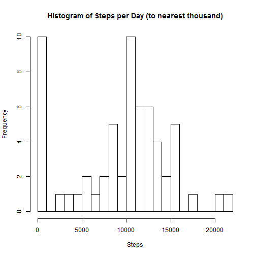
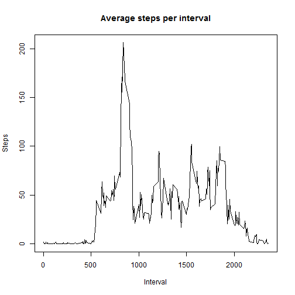
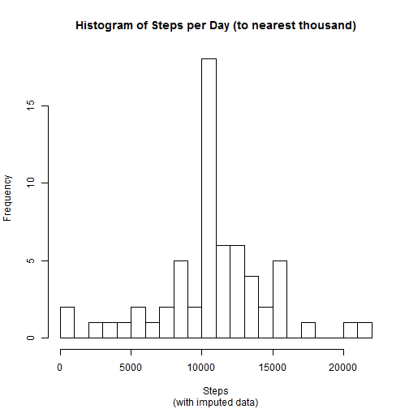

# Reproducible Research: Peer Assessment 1

A device was used to measure personal activity levels for an individual over the course of 61 days. The data set is available at [Activity monitoring data](https://d396qusza40orc.cloudfront.net/repdata%2Fdata%2Factivity.zip). What follows is a short breakdown of the data to get a sense of the subject's typical daily activity and activity across the day.

## Loading and preprocessing the data
  (with the working directory pre-set to the location of activity.csv)

```r
setwd("C:/Users/Geoff/git/RepData_PeerAssessment1/activity")
dat<-read.csv("activity.csv", colClasses="character") ## for faster reading
dat$date<-as.Date(dat$date, format="%Y-%m-%d") ## data column types assigned
dat$steps<-as.numeric(dat$steps)
dat$interval<-as.numeric(dat$interval)
```

## What is mean total number of steps taken per day?

```r
## spd: steps per day
spd<-aggregate(x=dat$steps, by=list(dat$date), FUN=sum, na.rm=TRUE) ## aggregate by day
## standard histogram with 22 breaks to approximate a rough 0-22,000 steps per day range
hist(spd$x, breaks=22, xlab="Steps", main="Histogram of Steps per Day (to nearest thousand)")
```

 

```r
## mean and median data
print(paste("Mean:", mean(spd$x), "and Median:", median(spd$x), sep=" "))
```

```
## [1] "Mean: 9354.22950819672 and Median: 10395"
```

## What is the average daily activity pattern?

```r
## spi: steps per interval
spi<-aggregate(x=dat$steps, by=list(dat$interval), FUN=mean, na.rm=TRUE) ## aggregate by interval
plot(spi$Group.1, spi$x, main="Average steps per interval", xlab="Interval", ylab="Steps", type="l")
```

 

```r
print(paste("Interval ", spi$Group.1[which.max(spi$x)], " has the most steps, ", max(spi$x),".", sep=""))
```

```
## [1] "Interval 835 has the most steps, 206.169811320755."
```

## Imputing missing values

```r
nas<-length(dat$steps[is.na(dat$steps)]) ## identify number of NAs
```
There are 2304 NAs in the data set. The code below replaces them with the average value for the time interval in question.


```r
dati<-dat ## create data frame to include imputations
for(i in 1:nrow(dati)) {  ## replace NAs with average daily value for the interval
  if(is.na(dati$steps[i])) {
    m<-dati$interval[i]
    n<-spi$x[spi$Group.1==m]
    dati$steps[i]<-n
  }
}
## daily data from data source with imputation
spdi<-aggregate(x=dati$steps, by=list(dati$date), FUN=sum, na.rm=FALSE) ## aggregate by day
## standard histogram with 22 breaks to approximate a rough 0-22,000 steps per day range
hist(spdi$x, breaks=22, xlab="Steps", main="Histogram of Steps per Day (to nearest thousand)", sub="(with imputed data)")
```

 

```r
## mean and median data
print(paste("Mean:", mean(spdi$x), "and Median:", median(spdi$x), sep=" "))
```

```
## [1] "Mean: 10766.1886792453 and Median: 10766.1886792453"
```
Note that use of interval averages for NA values greatly reduces days at the low end of the scale while pulling the average individual day closer to the overall average. It also pulls the mean and median closer together.

## Are there differences in activity patterns between weekdays and weekends?

```r
## add factor value to distinguish weekdays and weekends
dati$wkday<-"weekday"
x<-grep("Saturday|Sunday", weekdays(dati$date))
dati$wkday[x]="weekend"
dati$wkday<-as.factor(dati$wkday)
spii<-aggregate(x=dati$steps, by=list(dati$interval, dati$wkday), FUN=mean)
colnames(spii)<-c("Interval", "Weekday", "Steps")
library(lattice)
xyplot(Steps~Interval|Weekday, data=spii, layout=c(1,2), type="l")
```

 

As can be seen, weekend activity starts a little later and is more consistent whereas there is a surge in activity in the morning and a lull in the afternoon during the week.
